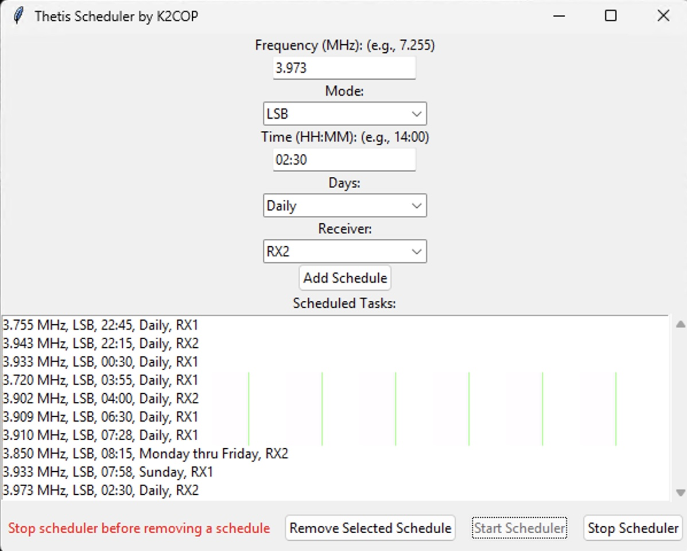
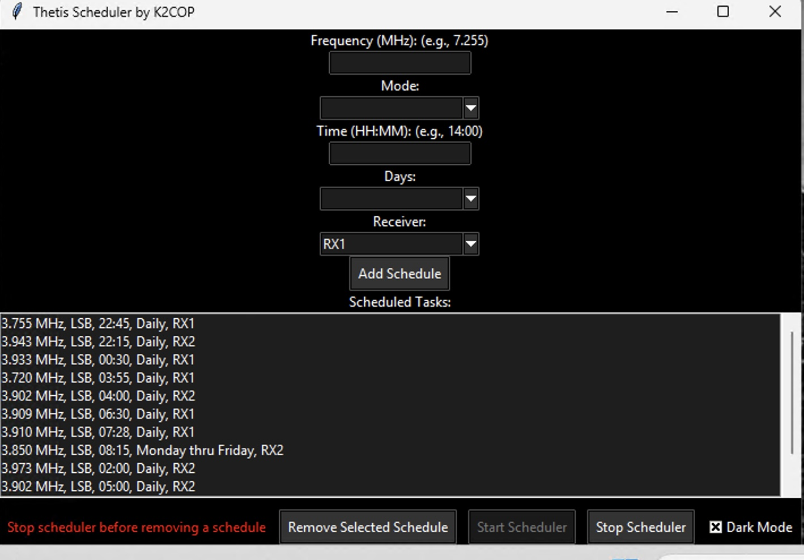
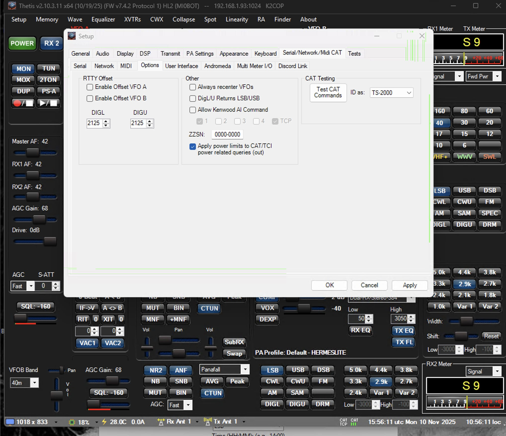
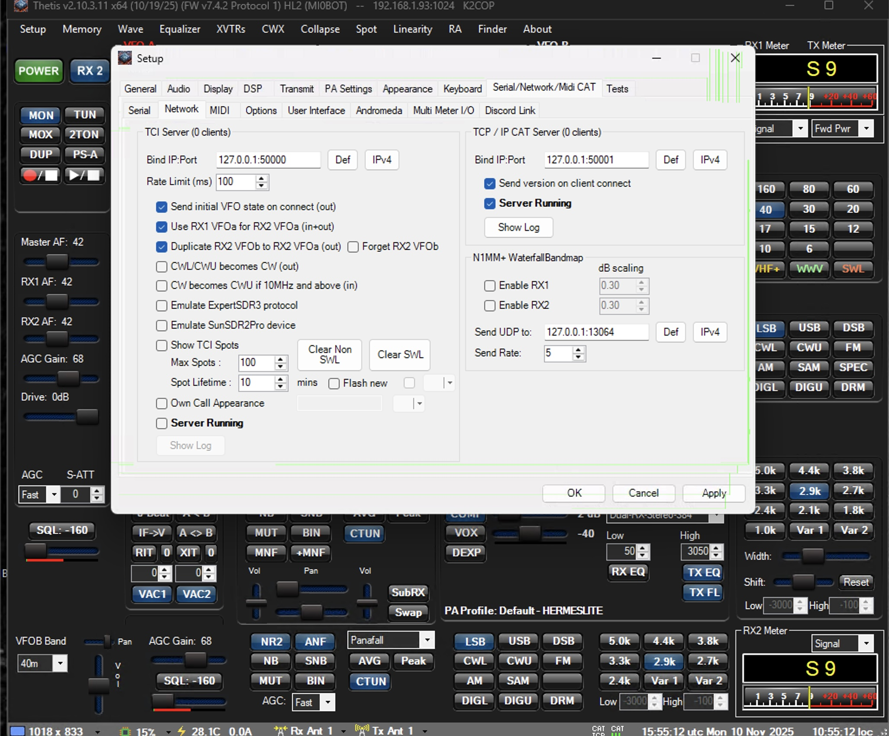

<h1 align="center">Thetis Scheduler</h1>

<p align="center">
  <strong>Automatic, timed frequency and mode changes for the Hermes Lite 2 running Thetis</strong>
</p>

<p align="center">
  
  
  
  <a href="LICENSE"></a>
</p>

<table align="center">
  <tr>
    <td align="center"><br><sub>Light mode</sub></td>
    <td align="center"><br><sub>Dark mode</sub></td>
  </tr>
</table>

Thetis Scheduler is a small Python program by K2COP that changes the frequency and mode of a Hermes Lite 2 running Thetis at the times and days you choose. It talks to Thetis through its CAT (Computer Aided Transceiver) interface, using Kenwood TS-2000 commands. Schedules are saved to a file, so they are still there the next time you start the program.

> **Tested with:** the MI0BOT version of Thetis, where it works flawlessly. It has **not** been tested yet with the full version of Thetis from Apache-Labs.com. It should work there too if you make the CAT settings shown in [Thetis setup](#thetis-setup).

**Contents:** [Which script?](#which-script-should-i-use) · [Features](#features) · [Requirements](#requirements) · [Installation](#installation) · [Running it](#running-it) · [Using it](#using-it) · [Thetis setup](#thetis-setup) · [Changes](#changes) · [License](#license)

## Which script should I use?

| Script | What it does |
| --- | --- |
| `thetis_scheduler_gui_dual.py` | **Recommended.** Supports both receivers (RX1 and RX2) and has a Dark Mode switch. |
| `thetis_scheduler_GUI.py` | The original version. RX1 only, no dark mode. |

## Features

- **Scheduled changes:** set a frequency (for example 3.777 MHz) and mode (USB or LSB) for a time of day, either Daily, Monday thru Friday, or a single day of the week.
- **RX1 or RX2:** choose which receiver each scheduled change applies to.
- **Automatic mode:** leave Mode blank and the program picks the usual sideband for the band: LSB on 160, 80 and 40 m, USB on 30 m and up.
- **Dark Mode:** tick **Dark Mode** at the bottom right for a black window with white text. Untick it to go back to the normal look.
- **Saved schedules:** kept in `schedules.json` next to the script.
- **Log file:** everything the program does, including errors, is written to `scheduler.log`. It is the first place to look if something doesn't work.
- **Input checks:** frequencies outside 1–60 MHz and missing times or days are rejected with a message.

## Requirements

- A Hermes Lite 2 running Thetis, with the CAT server set up on port `50001` (see [Thetis setup](#thetis-setup)).
- Windows, running on the same computer as Thetis. It has been tested on Windows 11.
- Python 3.13 or later (tested with 3.13.3). Get it from [python.org/downloads](https://www.python.org/downloads/) or the Microsoft Store. Either works.
- The `schedule` library. Everything else the script uses comes with Python.

## Installation

1. **Install Python** (see Requirements).
2. **Install the `schedule` library.** Open a Command Prompt (type `cmd` in the Windows search box) and run:
   ```
   pip install schedule
   ```
   If `pip` isn't found, use `py -m pip install schedule` instead.
3. **Download Thetis Scheduler.** Either click the green **Code** button on this page and choose **Download ZIP** (then unzip it), or, if you use git:
   ```
   git clone https://github.com/K2COP/Thetis-Scheduler.git
   ```

## Running it

In the Command Prompt, go to the folder where the scripts are and start the program:

```
cd Thetis-Scheduler
py thetis_scheduler_gui_dual.py
```

(Use `py thetis_scheduler_GUI.py` for the original version.) If all went well, the program window opens.

Always start it from inside that folder. The program saves `schedules.json` and `scheduler.log` in whatever folder the Command Prompt is in, so starting it from somewhere else would make your schedules seem to disappear.

**Tip:** you can pin Command Prompt to the taskbar. After a reboot, open it, press the **Up arrow** key to bring back the last command (for example `py thetis_scheduler_gui_dual.py`), and press **Enter**.

## Using it

1. Enter a **Frequency** in MHz (for example `7.255`).
2. Pick a **Mode** (USB or LSB), or leave it blank to have it chosen from the band.
3. Enter a **Time** in 24-hour HH:MM format (for example `14:00`).
4. Pick the **Days**.
5. Pick the **Receiver**: RX1 or RX2.
6. Click **Add Schedule**. It appears in the Scheduled Tasks list.
7. Click **Start Scheduler**. Changes happen only while the scheduler is running and the program is open.

To remove a schedule, click **Stop Scheduler** first, select the schedule in the list, and click **Remove Selected Schedule**.

**First-time note:** the first time you add a scheduled change, close the program and start it again so it reads the new `schedules.json` file. After that, everything works as expected.

## Thetis setup

The scheduler connects to Thetis's CAT server at `127.0.0.1` on port **50001**. In Thetis, open **Setup** and change the CAT settings to match the screenshots below.

> **Important:** two ports cannot both be set to 50001. If another CAT port is already using 50001, change that one, or it will not work.

<table align="center">
  <tr>
    <td align="center"><br><sub>Setup → CAT options</sub></td>
    <td align="center"><br><sub>Setup → CAT server</sub></td>
  </tr>
</table>

<p align="center"><sub>Click a screenshot to see it full size.</sub></p>

## Changes

- **2026-09-28:** Added a Dark Mode switch to `thetis_scheduler_gui_dual.py`.
- **2025-11-10:** Added `thetis_scheduler_gui_dual.py` with a choice of RX1 or RX2 for each scheduled change.
- **2025-06:** First release, `thetis_scheduler_GUI.py`.

## License

GNU General Public License v3.0. See [LICENSE](LICENSE).

---

<p align="center"><sub>73 de K2COP</sub></p>
